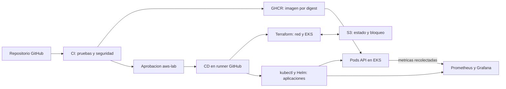
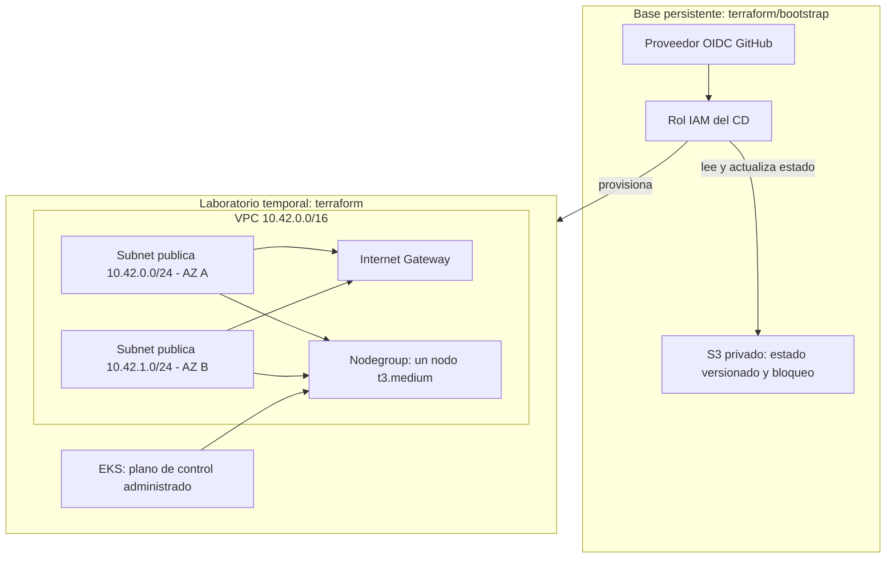
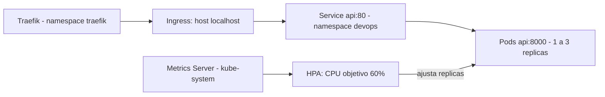
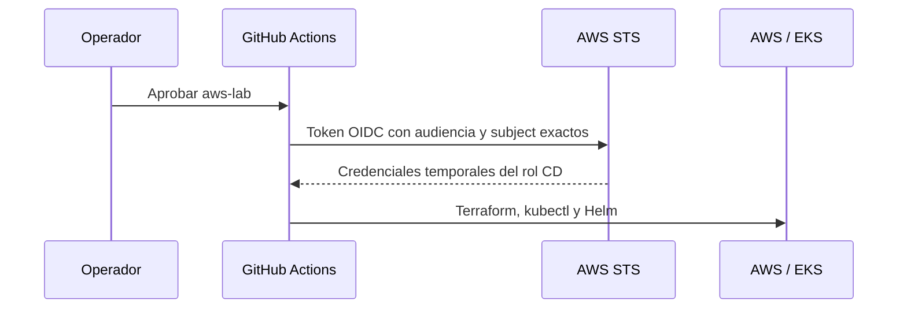
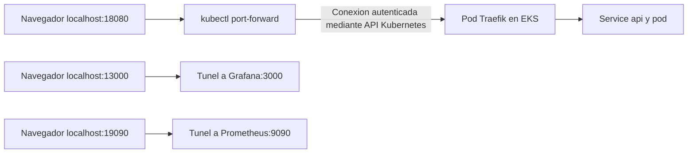
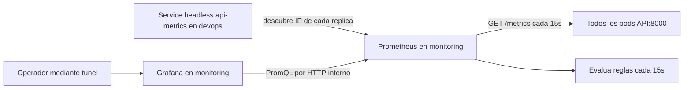

# Arquitectura del proyecto DevOps

Documento basado en los manifiestos y workflows del repositorio, revisado el
2026-10-01. Describe la configuracion desplegable; no certifica que AWS este
encendido en este momento. Las evidencias tienen su propia fecha y alcance.

## 1. Objetivo y componentes

API sin estado para convertir temperaturas, empaquetada como contenedor y
operada en Kubernetes. No hay frontend propio ni base de datos de negocio.
Swagger permite probar la API desde el navegador. El mismo codigo se usa en kind
y en EKS; cada entorno tiene sus propios pods y sus propias metricas.

| Componente | Responsabilidad | Configuracion |
| --- | --- | --- |
| FastAPI / Uvicorn | HTTP, conversiones, salud y metricas | [app/main.py](../app/main.py) |
| Docker | Imagen multi-stage, usuario UID 10001, un worker | [Dockerfile](../Dockerfile) |
| CI | Pruebas, SAST, DAST, validaciones y publicacion | [ci.yml](../.github/workflows/ci.yml) |
| CD | Autenticacion, provisionamiento, despliegue y destruccion | [cd.yml](../.github/workflows/cd.yml), [script](../scripts/cd_aws.sh) |
| Terraform | Recursos AWS y estado de infraestructura | [terraform/](../terraform/README.md) |
| Traefik | Resuelve el Ingress hacia el Service de la API | [valores AWS](../k8s/aws/traefik-values.yaml) |
| Metrics Server + HPA | Metricas de CPU y escalado de replicas | [HPA](../k8s/hpa.yaml) |
| Prometheus | Scraping, historial temporal y reglas de alerta | [monitoring/](../monitoring/README.md) |
| Grafana | Consulta Prometheus y muestra el dashboard | [dashboard](../monitoring/api-dashboard.json) |

## 2. Entornos

| Caracteristica | Local | AWS |
| --- | --- | --- |
| Kubernetes | kind sobre Docker Desktop | EKS 1.35 |
| Contexto | kind-proyecto-devops | proyecto-devops-aws |
| Kubeconfig privado | .local/kubeconfig | .local/kubeconfig-aws |
| Nodo | Contenedor kind | Grupo administrado: un t3.medium AL2023 |
| API | localhost:8080 mediante mapeo kind y NodePort Traefik | localhost:18080 mediante port-forward |
| Traefik | NodePort 30080 | ClusterIP, sin balanceador AWS |
| Monitoreo | Namespace monitoring del cluster local | Namespace monitoring de EKS |
| Instalacion | scripts/start_local_k8s.ps1 | scripts/cd_aws.sh desde Actions |

Los parches de cgroups v1 y kubelet-insecure-tls se aplican solo en kind.
En EKS se instala el manifiesto de Metrics Server sin ese parche TLS.
Los puertos locales de Grafana (13000) y Prometheus (19090) son iguales en ambos
entornos: cerrar un tunel antes de reutilizar su puerto para el otro cluster.

## 3. Infraestructura AWS

El nodegroup puede ubicar el nodo en una de las dos subredes; dos subredes no
significan dos nodos ni alta disponibilidad de la aplicacion. Desired/min/max
son 1. El HPA escala pods, no instancias EC2. El disco del nodo es de 20 GB.

Las subredes tienen ruta a Internet Gateway e IP publica automatica para la
salida del nodo. No hay NAT Gateway, ALB, NLB, RDS ni acceso SSH configurado.
El endpoint administrativo EKS es privado para los nodos y publico restringido
al /32 del administrador y, durante CD, al /32 del runner. Esta URL administra
Kubernetes: no es la URL de Swagger ni de la API de temperaturas.

### Estado y separacion del bootstrap

- `terraform/bootstrap` mantiene un estado local privado. Administra bucket,
  cifrado AES256, versionado, bloqueo de acceso publico, politica TLS, proveedor
  OIDC y rol CD. Respaldar ese estado fuera de Git.
- `terraform` usa S3, key `lab/terraform.tfstate`, workspace `default` y
  `use_lockfile=true`. La cerradura usa `lab/terraform.tfstate.tflock`.
- El bucket no permite borrado mediante el bootstrap mientras este definido
  `prevent_destroy=true`; `force_destroy=false` evita vaciarlo automaticamente.
- `.terraform.lock.hcl` fija proveedores y checksums; **no es el estado ni el
  bloqueo de ejecucion**. Se versiona, con hashes Windows y Linux.
- Terraform administra AWS; Helm y kubectl administran Traefik, API y monitoreo.
  Esos objetos Kubernetes no estan registrados como recursos en el estado Terraform.

## 4. Aplicacion, salud y escalado

La API implementa `/`, `/health`, `/api/convert`, `/metrics` y `/docs`.
Cada pod ejecuta un worker Uvicorn. Las replicas no comparten memoria; los
contadores pertenecen a cada proceso y se reinician cuando este reinicia.

Por pod: requests 100m CPU / 64Mi RAM; limites 500m / 256Mi. HPA calcula su
objetivo del 60% respecto del request de CPU, con 1 a 3 replicas y ventana de
reduccion de 60s. Si el nodo no tiene capacidad, agregar replicas no garantiza
que puedan programarse: no hay Cluster Autoscaler instalado.

Startup, readiness y liveness probes consultan `/health`. Comprueban el proceso,
no dependencias externas. Kubernetes utiliza estas probes; el HEALTHCHECK del
Dockerfile sirve al ejecutar la imagen con Docker y no sustituye las probes.

La API usa UID 10001, filesystem de solo lectura, tmp limitado, sin capacidades
Linux ni token automatico de ServiceAccount. Agrega nosniff y CORP same-origin;
estas cabeceras no implementan autenticacion de usuarios.

## 5. Flujo CI/CD

1. Push a main, PR hacia main o ejecucion manual inicia CI.
2. Corren pytest, Bandit, validacion Terraform en Linux sin backend, y promtool
   para configuracion y pruebas de reglas.
3. Si pasan, Docker construye una imagen y arranca un contenedor temporal.
   Valida salud, endpoints, metricas y usuario. ZAP analiza OpenAPI contra ese
   contenedor; WARN/FAIL bloquean la publicacion. `/metrics` no esta en OpenAPI.
4. Solo un push a main publica en GHCR con etiquetas sha del commit y latest.
   Pasa al CD el digest de esa misma imagen; no se reconstruye en CD ni se usa latest.
5. Solo si la variable de repositorio `CD_ENABLED=true`, el CI llama al CD.
6. El job usa el entorno `aws-lab`: main, revisor Farid259, autoaprobacion
   permitida para el laboratorio individual y bypass de administradores desactivado.
7. Tras aprobar, GitHub obtiene credenciales temporales mediante OIDC. Terraform
   inicializa el backend S3, planifica y aplica el laboratorio.
8. El rol CD y el administrador obtienen acceso EKS mediante Access Entries.
   El runner configura su kubeconfig y despliega Metrics Server, Traefik y API.
9. El script sustituye el digest del manifiesto en el checkout del runner,
   espera el rollout y prueba salud/conversion mediante un tunel a AWS.
10. Aplica monitoring, espera los deployments, valida reglas y comprueba scraping,
    dashboard y consulta Grafana -> Prometheus con verify_monitoring.py.
11. El paso final retira el /32 del runner del endpoint EKS. Esta actualizacion
    usa AWS CLI fuera de Terraform; el siguiente plan refresca el estado real.

La concurrencia `aws-lab-terraform` serializa CD y destruccion con
cancel-in-progress=false; S3 aporta el bloqueo del estado. No reemplazan la
coordinacion con operadores que ejecuten Terraform manualmente.
No hay rollback automatico de la infraestructura si falla un paso. Una
cancelacion forzada puede impedir retirar el /32 temporal: comprobarlo en AWS.

| Variable | Ubicacion | Uso |
| --- | --- | --- |
| CD_ENABLED | Variables del repositorio | Habilita la llamada CI -> CD |
| AWS_ACCOUNT_ID | Entorno aws-lab | Cuenta esperada y variable Terraform |
| AWS_ROLE_ARN | Entorno aws-lab | Rol OIDC y acceso EKS del CD |
| TF_STATE_BUCKET | Entorno aws-lab | Backend S3 del laboratorio |
| ADMIN_CIDR | Entorno aws-lab | IPv4 publica /32 del operador |
| ADMIN_PRINCIPAL_ARN | Entorno aws-lab | Usuario o rol administrador EKS |

El workflow fija us-east-1. Existe AWS_REGION en el entorno como referencia,
pero cambiar solo esa variable no cambia la region del workflow actual.

## 6. Identidades y limites de confianza

La confianza verifica audiencia `sts.amazonaws.com` y el subject inmutable del
repositorio mas `environment:aws-lab`. Los IDs de propietario/repositorio estan
fijados en el bootstrap; no se admiten comodines. La restriccion de rama se
aplica en GitHub, porque el subject del entorno no contiene la rama.

El rol CD puede administrar los recursos del laboratorio y leer/escribir su
estado S3. No puede editar su propia confianza ni administrar el bootstrap.
El usuario local usa AWS CLI y permisos separados; DevOpsBootstrapAdmin se
reserva para configurar esa base. Las plantillas IAM en Git no son credenciales.

No se versionan tokens, claves, kubeconfig, tfvars reales, planes ni estados.
El repo publico permite leer codigo, no escribir ni asumir el rol por si solo.
No se deben ejecutar aportes externos con identidad AWS privilegiada.
Los permisos Kubernetes del administrador y del rol CD son cluster-admin para
este laboratorio; no constituyen un modelo de minimo privilegio de produccion.
No se han implementado NetworkPolicies de aislamiento entre namespaces.

## 7. Acceso desde la computadora

port-forward selecciona un pod detras del Service; no crea un balanceador ni una
URL publica. El proceso local debe permanecer vivo. Si el pod se reemplaza,
puede ser necesario reabrir el tunel. Escucha en 127.0.0.1 y requiere kubectl,
AWS CLI en PATH, sesion valida e IP permitida. localhost identifica la entrada
local del tunel: el procesamiento sigue ocurriendo en AWS.

Guia de API: [acceso AWS](../k8s/aws/README.md). Guia de dashboard y Prometheus:
[monitoreo](../monitoring/README.md). Cerrar tuneles no detiene cargos AWS.

## 8. Observabilidad

El descubrimiento DNS tipo A evita consultar un Service balanceado que alternaria
entre contadores de pods diferentes. publishNotReadyAddresses permite intentar
scraping incluso si una replica no esta lista. No usa permisos de lectura de la
API Kubernetes. Prometheus consulta solo la API del cluster donde se instala.

| Dato | Origen / interpretacion |
| --- | --- |
| up | Resultado del scraping de cada instancia; no es una prueba funcional completa |
| http_requests_total | Contador por metodo, ruta y status |
| http_request_duration_seconds | Histograma por metodo y ruta; permite p95 |
| ALERTS | Estado de reglas evaluadas por Prometheus |

Dashboard: replicas disponibles, solicitudes/s, 5xx/s, p95 y alertas firing.
Trafico y latencia excluyen /health en sus paneles; el scraping /metrics nunca
incrementa el contador de la API. Las tasas usan ventanas de 5 minutos.
ApiUnavailable: todas las replicas caidas o series ausentes durante 1 minuto.
ApiHighErrorRate: proporcion 5xx mayor al 5% durante 2 minutos, calculada con
ventana de 5 minutos (incluye trafico de salud). No hay Alertmanager ni envio
externo de notificaciones; las alertas se ven en Prometheus y en el dashboard.

Metrics Server alimenta el HPA con CPU. Prometheus no controla el escalado.
La prueba promtool simula caida/recuperacion; no corta la API real. La verificacion
HTTP comprueba tambien la conexion real Grafana -> Prometheus -> API.

| Recurso | Requests CPU / RAM | Limites CPU / RAM | Datos |
| --- | --- | --- | --- |
| Prometheus | 100m / 128Mi | 500m / 512Mi | emptyDir 1Gi; retencion 24h o 512MB de bloques |
| Grafana | 100m / 256Mi | 500m / 768Mi | emptyDir 2Gi y tmp 64Mi |

Son replicas unicas. emptyDir se pierde al reemplazar el pod, no solo al destruir
EKS. Configuracion y dashboard se restauran desde ConfigMaps generados por
Kustomize. No hay PVC, backups de metricas ni almacenamiento remoto configurado.
Grafana incluye una base SQLite interna temporal; no es una base de negocio de
la API. El WAL de Prometheus requiere espacio adicional al limite de bloques.

Grafana permite lectura anonima Viewer dentro de la red accesible, con login
oculto y sin administrador inicial. No publicar ese Service en Internet tal como
esta. Ambos contenedores usan usuarios no root y no montan token Kubernetes.
Grafana permite escritura para registrar plugins; requiere salida de red para
las instalaciones que realiza al arrancar. Las imagenes de monitoreo usan tags
fijos de version, no digest; no tienen la misma inmutabilidad que la imagen API.

## 9. Ciclo de vida y costos

Para destruir: Actions -> CD - AWS lab -> Run workflow sobre main -> confirmation
`proyecto-devops-lab` -> aprobar aws-lab. La ejecucion manual de ese workflow
selecciona destroy; no sirve para elegir una imagen y desplegarla manualmente.

| Se elimina con destroy del laboratorio | Se conserva |
| --- | --- |
| Cluster EKS y nodegroup EC2 | Bucket S3, objetos/versiones del estado y bloqueo disponible |
| Red creada por Terraform | Proveedor OIDC y rol CD |
| Pods API, Traefik, Metrics Server, Prometheus y Grafana | Usuario IAM y politicas externas al estado del laboratorio |
| Historial temporal y SQLite del monitoreo | Imagenes GHCR y artifacts hasta su vencimiento |

Comprobar que destroy termino y no quedan recursos facturables del laboratorio.
El bootstrap tiene ciclo de vida separado. S3 puede seguir generando cargos por
almacenamiento y solicitudes. Poner CD_ENABLED=false evita futuras llamadas de
CI a deploy; no destruye lo que ya este activo ni bloquea el workflow de destroy.
Por decision de alcance, el operador inicia la destruccion manual desde Actions
al terminar las pruebas. No hay apagado programado ni garantia de costo maximo. EKS y EC2 generan cargos mientras existen, aunque no haya trafico.

## 10. Validacion y siguientes mejoras

API y primer CD AWS fueron probados por el usuario. Monitoreo tiene evidencia
local reproducible en [monitoring-local.txt](evidence/monitoring-local.txt).
No extrapolar esa evidencia a AWS: registrar la ejecucion CD con monitoreo y
capturas del entorno remoto antes de afirmar su validacion completa.

Pendientes de entrega: reunir las evidencias finales e informe final. Para evolucionar a produccion: autenticacion, aislamiento de red, permisos
Kubernetes mas acotados, persistencia/backup de observabilidad, disponibilidad
multinodo, notificaciones externas y analisis de dependencias/imagenes.

Este dise?o prioriza un laboratorio reproducible y temporal. No promete alta
disponibilidad ni operacion de produccion.

### Ayudante de conexion

[scripts/connect_aws.ps1](../scripts/connect_aws.ps1) sincroniza la IP /32 del
operador con EKS, GitHub y tfvars y abre el tunel seleccionado. Uso y limitaciones
en la [guia AWS](../k8s/aws/README.md#conexion-automatica-a-aws-desde-powershell).
